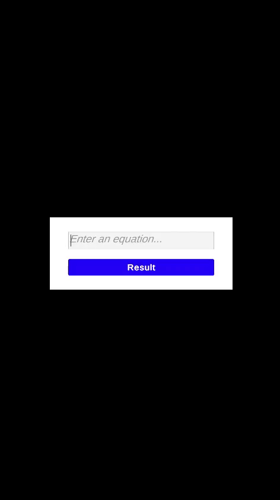

<h1 align="center">MVP Passive View Code Example</h1>

# Description

It is necessary to create a calculator that supports only one mathematical operation – addition. The results of calculations and the state of the application are preserved between sessions – it is required to store and display the calculation history and the input state.

# Features

* Supported arithmetic operation is addition. If the user enters anything other than numbers and the "+" sign, the result should display the message "Error". Examples of correct expressions: 54+21, 45+00.
* Saving the application state between sessions. When the user closes the application, its state should be saved, in this case – the expression entered by the user and the calculation history.

# Requirements

* Clean Architecture  
* Model View Presenter  
* Modularity (Assembly Definition)

## Result

  

📱 [APK](Result.apk)

## Modularity

The application is divided into 3 main modules: Core, Runtime, UI.  
* Core – the heart of the business logic.  
* Runtime – connects the business logic and the UI.  
* UI – everything related to display and user input.

Saving and loading of data is performed in the `CalculationHistory.cs`. Data is saved in JSON format, and the `Newtonsoft.Json` library is used for working with JSON.

## Stack:
* **Unity 6**
* **Newtonsoft.Json**